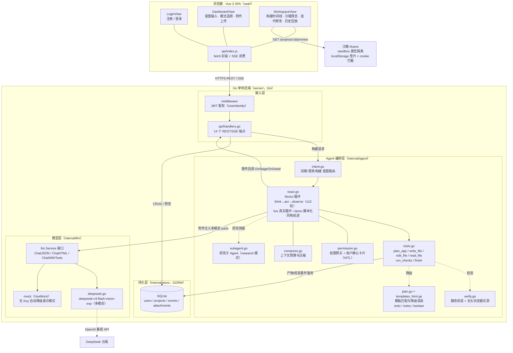
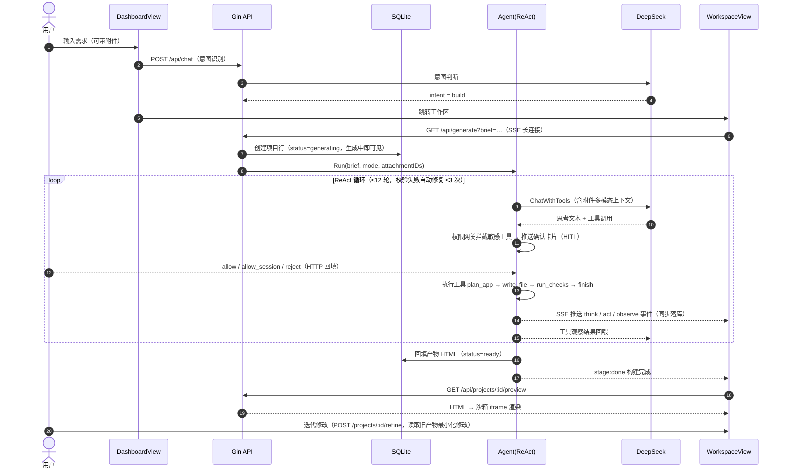
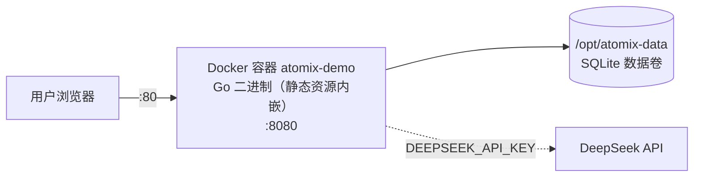

# Atomix 架构

> AI Agent 驱动的应用生成平台。用户用自然语言描述需求，Agent 经 ReAct 循环（规划 → 写码 → 校验 → 修复）生成单文件 HTML 应用，SSE 实时推送构建时间线，沙箱 iframe 实时预览。

## 总体架构



## 生成流水线（时序）



## 目录结构

```
atomix-demo/
├── web/                        # Vue 3 + Vite 前端
│   └── src/
│       ├── views/              # Login / Dashboard / Workspace 三视图
│       ├── api/index.js        # fetch 封装 + SSE 消费
│       └── router/             # 路由（login/dashboard/workspace）
├── server/                     # Go 单体后端（Gin + GORM + SQLite）
│   ├── main.go                 # 入口：装配依赖，静态资源托管
│   └── internal/
│       ├── api/                # 14 个 REST/SSE 端点
│       ├── middleware/         # JWT 鉴权
│       ├── agent/              # 意图路由 + ReAct 循环 + 工具集 + 模板
│       ├── llm/                # Service 接口 + DeepSeek 实现（双模式）
│       ├── store/              # GORM 模型（users/projects/events/attachments）
│       ├── auth/               # bcrypt + JWT 签发
│       └── config/             # 环境变量装配（含 UseMock 判定）
├── Dockerfile                  # 前端构建产物内嵌进 Go 二进制，单容器部署
└── docs/
```

## API 端点

| 方法 | 路径 | 鉴权 | 说明 |
| --- | --- | --- | --- |
| GET | `/api/health` | - | 健康检查（返回 live/demo 模式） |
| POST | `/api/auth/register` | - | 注册（bcrypt 哈希） |
| POST | `/api/auth/login` | - | 登录（签发 JWT） |
| GET | `/api/me` | JWT | 当前用户信息 |
| GET/POST | `/api/projects` | JWT | 项目列表 / 创建 |
| GET | `/api/projects/:id` | JWT | 项目详情（含产物 HTML） |
| GET | `/api/projects/:id/events` | JWT | 构建事件（历史回放） |
| GET | `/api/projects/:id/preview` | JWT | 产物 HTML（沙箱预览） |
| POST | `/api/projects/:id/refine` | JWT/SSE | 迭代修改（SSE 推送） |
| GET | `/api/generate` | JWT/SSE | 自然语言生成（SSE 实时时间线） |
| POST | `/api/chat` | JWT | 意图路由（闲聊/澄清/构建） |
| POST/GET | `/api/attachments` | JWT | 附件上传 / 列表 |
| GET | `/api/attachments/:id` | JWT | 附件内容（图片转 dataURL 多模态注入） |
| POST | `/api/permissions/:reqId` | JWT | 权限确认回填（allow / allow_session / reject） |

## 关键设计

- **三模式构建**：`build` 标准构建 / `plan` 两阶段规划先行（工具层门控：plan_app、commit_plan 之外物理不可见，commit_plan 提交后解锁实施工具） / `research` 研究子 Agent 独立上下文拆解需求，简报注入主循环构建。
- **权限网关（HITL）**：`write_file` / `edit_file` 等 ask 级工具调用前推送确认卡片；用户 allow / allow_session / reject，HTTP 接口按请求 ID 回填注册表解除阻塞，超时或拒绝则把拦截结果回喂模型。
- **上下文压缩**：消息历史接近预算时自动压缩为状态摘要，保留 system / 需求 / 最近消息，长任务不爆上下文。
- **自修复闭环**：`run_checks` 静态校验 + 无头浏览器实测运行时异常，失败优先 `edit_file` 片段级精准修复（≤3 次），整体性缺陷才 `write_file` 重写（成功写入 ≤2 次）。
- **事件双写**：SSE 实时推送的同时落库 `events` 表，历史项目可完整回放 ReAct 轨迹。
- **项目行先行落库**：构建任务开始前即创建 `status=generating` 的项目行，修复"生成中不可见"问题。
- **沙箱安全**：产物在 `sandbox` 属性 iframe 中运行；`document.cookie` 在校验层与提示词双重拦截，`localStorage` 不可用时平台自动垫片降级。
- **多模态附件**：图片附件以 `image_url` parts 注入 vision 模型，文本附件并入用户消息。
- **防护栏**：ReAct ≤12 轮（plan 模式 +4）、自动修复 ≤3 次。

## 部署拓扑


